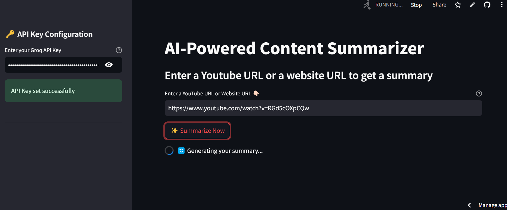
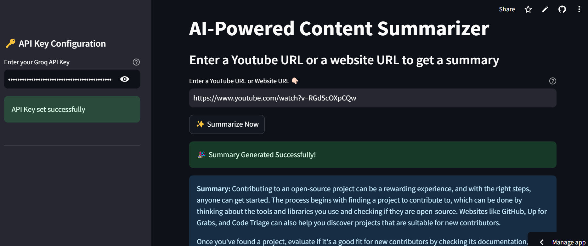
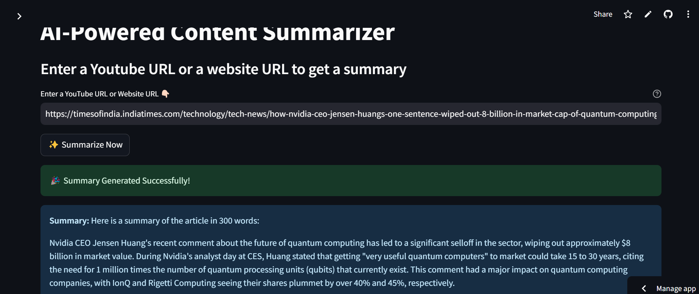

# 🌟 AI-Powered Content Summarizer: From YouTube & Websites

## 📝 Project Overview

This project is an **AI-driven application** designed to generate concise and accurate summaries from YouTube videos and website content. By leveraging the latest in **language models** and a user-friendly interface, this tool makes it easy to distill complex or lengthy information into actionable insights. Whether you're a researcher, student, or professional, this app empowers you to save time and focus on what truly matters.


## ✨ Features

- 🎥 **Summarize YouTube Videos**: Input a YouTube link to receive a detailed yet concise summary.
- 🌐 **Summarize Websites**: Provide a URL to summarize web page content.
- ⚡ **Real-Time Processing**: Generate summaries instantly.
- ❌ **Error Messages with Solutions**: Ensures smooth user experience by addressing input and token limit errors.

---
## 📂 Project Structure

```
📂 Project Folder
├── app.py                  # Main entry point for Streamlit
├── requirements.txt        # Dependencies for the app
├── Dockerfile              # For Docker containerization
└── README.md               # Project documentation
```

---


## 🔧 How It Works

### 1️⃣ Input
- Enter your **Groq API Key** in the sidebar.
- Provide a **valid URL** (YouTube or website).

### 2️⃣ Validation
- The app ensures:
  - The API key is entered and valid.
  - The provided URL is correctly formatted and accessible.

### 3️⃣ Content Extraction
- **YouTube Videos**: Extracts video content using `YoutubeLoader`.
- **Web Pages**: Extracts textual data using `UnstructuredURLLoader`.

### 4️⃣ AI Summarization
- Uses a **custom prompt** to summarize content into 300 words.
- Employs the **LangChain Summarization Chain** powered by the Groq LLM.

### 5️⃣ Output Feedback
- Success messages display the summary.
- Detailed error messages help users resolve issues like token limits or invalid inputs.


---

## ⚙️ Installation

1. Clone the repository:
   ```bash
   git clone https://github.com/kiran-91/Youtube-and-Website-Summarization.git
   cd Youtube-and-Website-Summarization
   ```

2. Install dependencies:
   ```bash
   pip install -r requirements.txt
   ```

3. Run the application:
   ```bash
   streamlit run app.py
   ```

---

## Results
> Important Update: Due to a recent security incident involving unauthorized use of my API keys in a DDoS attack, i have temporarily suspended cloud deployment of my Streamlit app and removed all those deployed apps. Please follow the installation guide to run the app locally. I am here to support you with any issues that may arise


---

## 💻 Usage

1. Access the app by clicking the provided [link](https://ytsummarise.streamlit.app/) or, if running locally, navigate to `http://localhost:8501` in your browser after running the app with `streamlit run app.py`.
2. Enter your **Groq API Key** in the sidebar.
3. Input a **YouTube or website URL**.
4. Click the **Summarize this URL** button.
5. Enjoy your AI-generated summary! 🎉

---

## 🌟 Example

### Input:
- **YouTube URL**: `https://www.youtube.com/watch?v=example`
- **Website URL**: `https://example.com/article`

### Output:
- A precise 300-word summary of the content.

---

## 📸 Screenshots




--- 

## 🛠️ Troubleshooting

### Common Issues:

1. **Invalid URL or API Key**:
   - Ensure the Groq API Key is correct.
   - Verify the URL is properly formatted.

2. **Token Limit Exceeded**:
   - Reduce the content length.
   - Upgrade your API plan to support higher token limits.

3. **Error Message: `please reduce your message size and try again`**:
   - Content is too long. Use shorter content or upgrade your API plan.


---

## 🤝 Contribution

1. Fork the repository.
2. Create a new branch:
   ```bash
   git checkout -b feature-name
   ```
3. Commit your changes:
   ```bash
   git commit -m "Description of changes"
   ```
4. Push to the branch:
   ```bash
   git push origin feature-name
   ```
5. Open a Pull Request.

---

## 📜 License

This project is licensed under the **General Public License V3**. See the `LICENSE` file for more details.

---

## 🙌 Acknowledgments

- [LangChain](https://www.langchain.com/): Framework for tool and LLM integration.
- [Streamlit](https://streamlit.io/): For fast, interactive app development.
- [GROQ API](https://www.groq.com/): For enabling advanced LLM responses.

---

## 📧 Contact
For questions or contributions, feel free to connect!

